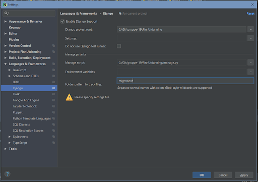
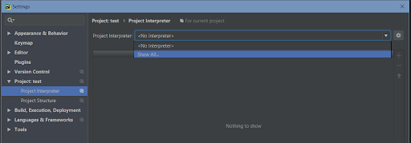
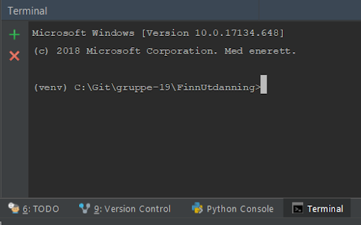

# FinnUtdanning

En nettside for å hjelpe studenter finne en utdanning som passer dem basert på interesser.

## Motivasjonen for dette prosjektet

25% av alle studenter bytter studie og det er både dyrt for samfunnet og studentene.
Derfor ville vi utvikle en side som kan hjelpe riktig fra starten av, i stedet for å kaste bort
tid, penger og motivasjon på et studie de ikke vil fullføre.

## Installering og konfigurering

For å installere projektet trenger du [Python](https://www.python.org/downloads/) 3.6 eller nyere, [Git](https://git-scm.com/downloads) og en IDE, vi 
brukte [PyCharm Professional](https://www.jetbrains.com/pycharm/download/#section=windows) og guiden vil være for PyCharm.

*  Først åpne opp PyCharm og velg “Check out from Version Control -> Git”. 
*  Fyll inn: “URL: https://gitlab.stud.idi.ntnu.no/programvareutvikling-v19/gruppe-19.git” og “Directory” kan være hvor du vil.

    

* Gå inn i innstillingene(Ctrl+Alt+S).
* Velg “Languages & Frameworks -> Django”.
* Klikk på “Enable Django Support”.
* Fyll inn “Django project root: {ditt Directory}\FinnUtdanning”, “Manage script: {ditt Director}/FinnUtdanning/manage.py” og “Folder pattern to track files: migrations”.

    

* Trykk Apply.
* Gå til “Project: {Navn på mappen prosjektet er i} -> Project Interpreter”.
* Velg “Project Interpreter -> Show All”.

    

* Trykk på plusstegnet eller Alt+Insert.
* Velg “New environment”.
* På “Location” skal du ha “{ditt Directory}\FinnUtdanning\venv”.

    

* Trykk OK til du er tilbake på Project Interpreter siden, der trykker du Apply så OK.
* Åpne så terminalen til PyCharm, den ligger i den nederst baren i PyCharm og den skal se ut som på bildet. 
Hvis du ikke er i FinnUtdanning mappen skriver du `cd FinnUtdanning` i terminalen, 
mangler du “(venv)” venter du litt så Project Interpreter-en blir installert, så åpner du terminalen på nytt. 

    

* I terminalen kjører du `pip install -r requirements.txt` og `python manage.py migrate`.

Prosjektet er nå installert og konfigurert. For å kjøre nettsiden kjører du kommandoen `python manage.py runserver` i terminalen.

## Credits
* [Chat design](https://bootsnipp.com/snippets/1ea0N) - [suneelrajpoot44](suneelrajpoot44) sin HTML og CSS template for chat
* [Heroku Django template](https://github.com/heroku/heroku-django-template) - Template som lett lot oss sette opp en Heroku server til prosjektet